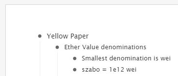
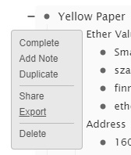
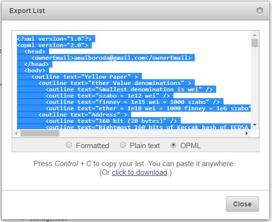

# Ethereum Yellow Paper notes in OPML format
These are the outline-style notes for quick reference based on Ethereum ["Yellow Paper" specification](https://github.com/ethereum/yellowpaper), originally by Gavin Wood.

OPML file can be imported into [WorkFlowy](https://workflowy.com/) or other tools for convenient view and edit. Publicly accessible rendered document can be found at https://workflowy.com/s/H4ol.uu3jlqyv23.

Licensed under the Creative Commons Attribution Share-Alike (CC-BY-SA) version 4.0.

## Contributing

1. Copy and paste the contents of  into [WorkFlowy](https://workflowy.com/), it will be parsed and inserted as an expanded outline.

3. Do your edits.

4. Hover over the bullet point of "Yellow Paper" top level item and select Export.

5. Switch to OPML format, copy the document contents and paste to your local forked .

5. Commit and submit the pull request.

